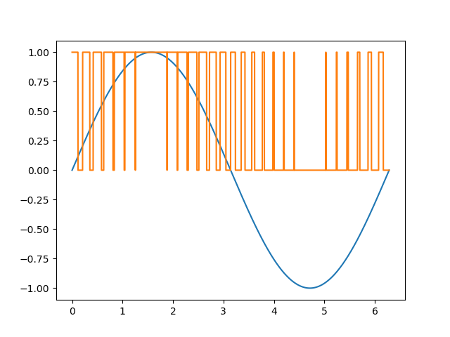
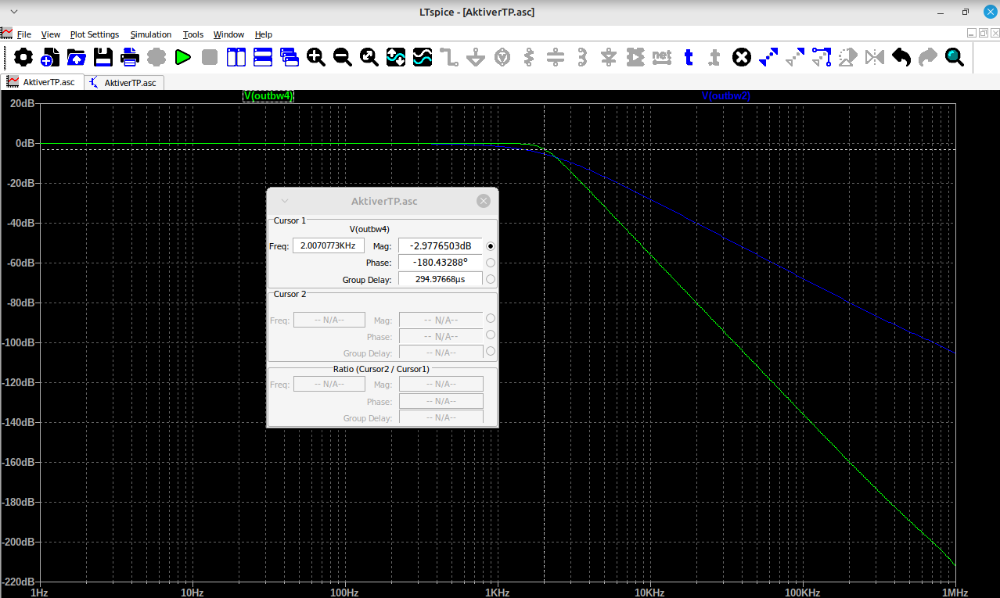
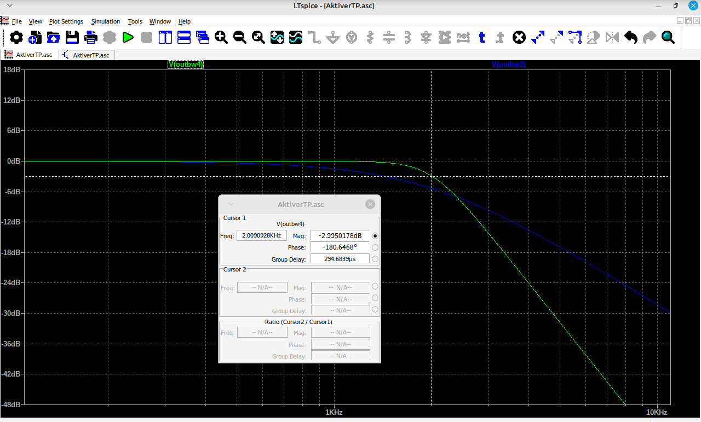
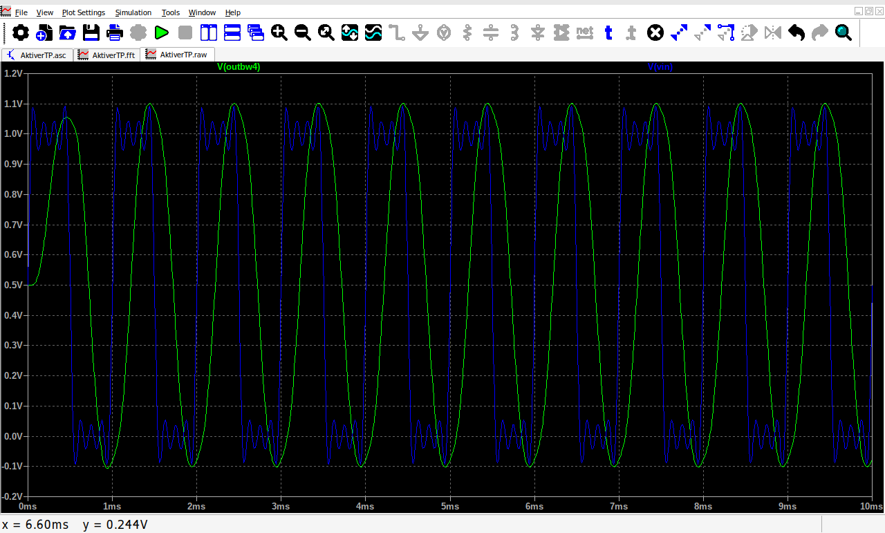
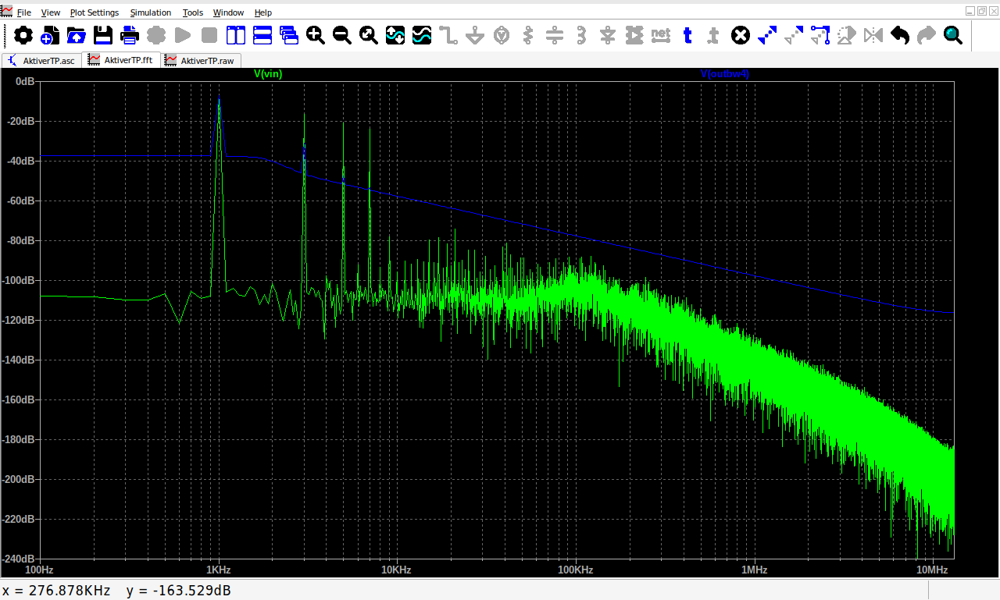

# Peperoni-Ripieni
DDS based multiphase signal generator with high order analog filter  stage

**repo in progress**

# Preface
In Math (as well as Physics and Electronics) a sine wave is the most beautiful thing one can get. 
A lot of mathematical issues (with technical appliance) can only be solved with respect to linear, sinus based fundamental operations.
Nevertheless generating such a pure sinus wave is not that easy. Conserving it throughout a technical system is even more challenging (grid noise, grid feedback). 

Apart from analog [oscillator circuits](https://www.allaboutcircuits.com/textbook/semiconductors/chpt-9/oscillator-circuits/) the DDS (Direct Digital Synthesis) is a method of generating sinusoidal waves with dynamic frequency and amplitude. It combines both analog and digital circuitry as well as a bit of embedded software.

# DDS

# Analog Filter 4th Order
Calculation Filter Capacities according to Spreadsheet with given R = 100k and Cutoff Frequency to 2kHz.  
  
    
    
    

# What is it good for ?
... well ... to quote Edwin Starr: "absolutely nothing!"   
No just kidding. 
- modern high resolution signal generators
- inverters for electric motors (electric powertrain in EV's)
- inverter for photovoltaic grid power feed in